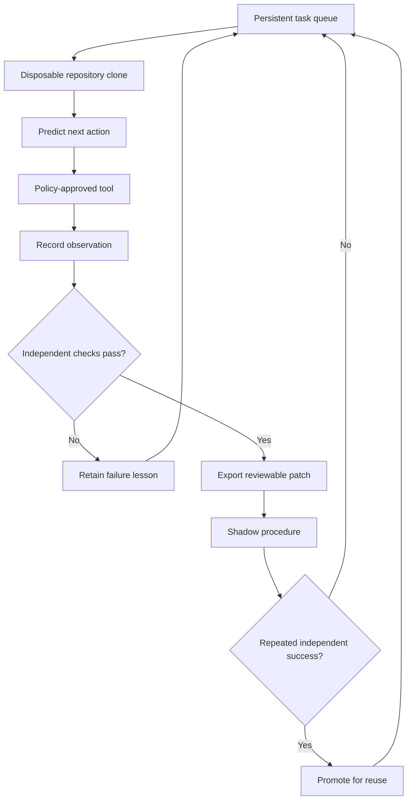

# Athena

Athena is an experimental architecture for intelligence that keeps learning
after deployment. It combines seven complementary systems:

- a numeric continual world model that predicts the next observation and
  updates online; and
- a provider-neutral agent layer that gives a stable pretrained foundation
  model episodic memory, evidence-gated facts, and behavior learned from the
  consequences of its own decisions; and
- a verified procedural skill layer that identifies knowledge gaps, learns an
  executable rule through instruction or active experimentation, tests it on
  held-out cases, and retains it without rewriting earlier skills; and
- a permissioned tool-learning agent that explores unfamiliar operations,
  predicts results before acting, verifies real state, and compiles successful
  traces into reusable workflows that bind to differently named tools; and
- a protected neural-plasticity layer that trains expandable neural experts from
  outcome-labelled experience and promotes new weights only after held-out and
  regression evaluation; and
- a grounded representation layer that compresses raw sensor grids into a
  learned latent state and reuses that state across protected reasoning heads;
  and
- a persistent apprenticeship runtime that accepts repository tasks, predicts
  before each action, works only in disposable clones, verifies outcomes,
  retains experience in a hash-chained ledger, and promotes repeated successful
  traces into reusable procedures.

Learning is explicit rather than hidden behind chat history. Predictions are
recorded before outcomes arrive, experience is the data, and neural candidate
training, replay, verification, promotion, and rollback are separately visible.
The hosted foundation remains stable while Athena's smaller protected neural
experts can change after deployment.

```text
predict -> observe -> measure surprise -> infer context -> update -> predict
   ^                                                               |
   +---------------------------------------------------------------+
```

The long-term goal is an intelligence that starts with broad pretrained
knowledge and develops through its own lifetime of experience. That does **not**
mean error must improve monotonically or that every environment is predictable.
It means its learning machinery remains plastic, bounded, inspectable,
testable, and resumable while observations and consequences keep arriving.

## Try Athena — v0.9

V0.9 is Athena's first persistent, continuously running agent loop for a real
domain: local software repositories. Here, “live” means the worker can stay
running, recover expired task leases after restart, accumulate verified
experience, and use retained procedures on later tasks. It does **not** mean
sentience, unrestricted autonomy, or permission to rewrite its own safeguards.



The foundation model proposes actions, but it cannot execute arbitrary shell
commands. The local runtime exposes only file listing, reading, literal search,
single-occurrence replacement, new-file creation, and exact verifier commands
chosen by the user when the task is submitted. Paths must remain inside a
disposable clone. The original repository is never edited; a successful task
produces a patch in the artifact directory.

### Run the live apprentice

Install the checkout and initialize persistent state:

```bash
python3 -m pip install -e .
athena-apprentice init
```

Queue a task with an observable goal and one or more exact checks:

```bash
athena-apprentice submit \
  --repo /path/to/repository \
  --kind fix-parser-edge-case \
  --goal "Handle an empty token list without changing valid parses." \
  --check "python -m pytest tests/test_parser.py"
```

The source must be a clean git working tree. This prevents uncommitted work from
being silently omitted when Athena creates its disposable clone.

Connect the OpenRouter reasoning backend and process one task:

```bash
export OPENROUTER_API_KEY="your-key"
export OPENROUTER_MODEL="nvidia/nemotron-3-ultra-550b-a55b:free"
athena-apprentice run
```

Or leave the bounded worker alive so it processes newly queued tasks:

```bash
athena-apprentice daemon --poll 2
athena-apprentice status
```

Status reports the verified success rate, cumulative foundation-reasoner steps,
procedure reuses, and mean prediction error in addition to queue, procedure,
heartbeat, and ledger health. Those measurements distinguish accumulated state
from actual improvement: a useful retained skill should preserve verification
while reducing new reasoning work on later tasks.

Failed attempts retain their verifier evidence as lessons. Requeue one unchanged
with `athena-apprentice retry TASK_ID`, or teach it and retry with
`athena-apprentice teach TASK_ID --instruction "..."`. The next model turn sees
both the explicit human instruction and recent failure summaries for that task
kind.

The browser never receives the provider key, and neither the key nor raw
provider requests/responses are written to the experience database. Validated
tool decisions and their observations are retained as experience. Run an
entirely offline, deterministic three-experience demonstration with:

```bash
python3 examples/live_apprentice.py
```

When OpenRouter is enabled, the goal, selected file contents, check output,
prior failure lessons, and current action trace may be sent to that provider so
it can choose the next tool. Do not submit confidential repositories unless the
configured provider and its data policy are appropriate for them.

The first two successful experiences remain reasoner-guided and independently
verified. Only then is the identical edit procedure promoted; the third task
reuses it with zero foundation calls. If that procedure later fails, Athena
rejects it, starts again from a fresh clone, and returns control to the reasoner.

### The safety boundary

V0.9 is intentionally narrower than a general computer-use agent:

- the source repository is read-only from Athena's perspective;
- changes occur in exact, internally created disposable directories;
- parent paths and symlinks that escape the clone are denied;
- model-selected operations are checked against strict local schemas;
- verifier commands use argv execution without a shell and a program allowlist;
- every prediction and observation is appended to a tamper-evident hash chain;
- patches are outputs for human review, not silently applied changes; and
- procedures need repeated independent successes and are rolled back on failure.

This is a containment boundary, not a hardened hostile-code sandbox. A verifier
such as `python -m pytest` executes repository code with the worker's operating
system privileges. Use trusted repositories and run the worker inside a VM or
container before evaluating untrusted code. Network access is not granted as an
Athena tool, but v0.9 does not enforce an operating-system network namespace.

## Interactive learning playground

The existing playground exposes five other kinds of post-deployment learning in
one local browser interface:

- **Representation learning:** give Athena raw two-channel 8×8 sensor grids.
  It learns a masked-reconstruction bottleneck, tests the latent state on unseen
  observations, grounds reasoning operators without object coordinates, compares
  them with an untrained-encoder control, and measures transfer under noisier,
  dimmer sensors.
- **Neural reasoning improvement:** train a fresh neural expert from labelled
  experiences. Athena measures accuracy before learning, changes real weights,
  evaluates unseen cases, replays protected abilities, and either promotes or
  rolls back the candidate before retained intelligence changes.
- **Tool-workflow learning:** send Athena into an opaque virtual workspace. It
  inspects manuals, uses only policy-approved tools, snapshots reversible writes,
  verifies the goal, and tests the compiled workflow in worlds with new tool
  names and task values.
- **Capability learning:** give Athena an unrevealed black-box sequence world.
  It reports what it does not know, chooses experiments, induces a procedure,
  verifies it independently, stores it, and runs it on inputs not seen during
  discovery.
- **Experience learning:** give the agent a real-world situation. It proposes an
  action before the outcome exists, then updates contextual strategy evidence
  from the measured result.

The experience path is explicit rather than hidden behind a chat box:

1. Give Athena a problem and a context.
2. Athena retrieves related experiences and established knowledge.
3. A foundation backend proposes candidate actions.
4. Athena predicts success and chooses before seeing the outcome.
5. Report whether the action worked and what happened.
6. Watch its memories, contextual strategies, and confidence change.

Launch the offline learning demo from the repository:

```bash
python3 -m athena.playground
```

Then open [http://127.0.0.1:8765](http://127.0.0.1:8765). The installed package
also provides:

```bash
athena-playground
```

The demo backend, tool workspace, and symbolic skill world are deterministic
rather than disguised language models. They let you test Athena's
post-deployment learning immediately without credentials or network access.

### Connect broad foundation intelligence

Set an API key in the server environment to let the same agent use a hosted
foundation model. The browser never receives or stores the key.

For the current free OpenRouter test model:

```bash
export OPENROUTER_API_KEY="your-key"
export OPENROUTER_MODEL="nvidia/nemotron-3-ultra-550b-a55b:free"
python3 -m athena.playground --foundation openrouter
```

The OpenRouter adapter uses Chat Completions function tools for candidate and
unfamiliar-tool decisions. The requested free Nemotron endpoint supports tool
calling but not enforced `response_format`, so Athena validates the tool name,
exact argument set, argument types, predictive fields, and confidence again
locally before its permission policy can execute anything. `--foundation auto`
selects OpenRouter when `OPENROUTER_API_KEY` is present. You can change models
with `OPENROUTER_MODEL` or `--model`. See OpenRouter's official
[model page](https://openrouter.ai/nvidia/nemotron-3-ultra-550b-a55b%3Afree),
[API reference](https://openrouter.ai/docs/api_reference/overview), and
[tool-calling guide](https://openrouter.ai/docs/guides/features/tool-calling).

Do not send secrets, personal data, or confidential material to the free
endpoint. Its model page says free-endpoint use is logged for security and
NVIDIA product improvement.

For OpenAI:

```bash
export OPENAI_API_KEY="your-key"
export OPENAI_MODEL="gpt-5.6"
python3 -m athena.playground --foundation openai
```

The OpenAI adapter uses the Responses API with strict Structured Outputs for
candidate actions and strict function tools for unfamiliar-tool decisions. The
permission policy still runs locally after either provider selects a call. You
can select another compatible OpenAI model through `OPENAI_MODEL` or `--model`.
See the official [Structured Outputs](https://developers.openai.com/api/docs/guides/structured-outputs)
and [function calling](https://developers.openai.com/api/docs/guides/function-calling)
documentation.

Experience state is checkpointed after every prediction, outcome, and factual
update at `~/.athena/playground.npz` by default. Symbolic skills are stored in
`~/.athena/playground.skills.json`, and verified tool workflows in
`~/.athena/playground.tool-skills.json`. Consolidated neural experts, protected
replay cases, and their actual parameters are stored in
`~/.athena/playground.plasticity.npz`. Learned sensor representations, grounded
operators, replay, probes, and exact parameters are stored in
`~/.athena/playground.representations.npz`. Use `--state PATH` for another
identity or experiment. Because live requests include the current task and retrieved
learning context, do not place sensitive information in the agent unless it is
appropriate to send to the configured model provider.

### What the playground can and cannot do

It can learn a compressed latent state from raw pixels, reuse it across multiple
reasoning heads, change small neural networks after deployment, recruit isolated
capacity, transfer learned relations to unseen values, replay protected cases,
reject regressive updates, learn permissioned workflows across differently named
virtual tools, acquire procedures in its constrained symbolic language, reason
through a connected foundation model, and resume every learning subsystem after
restart.

The playground deliberately does **not** execute an arbitrary shell or connect
the demo to external accounts. Its tool tab still executes only inside
`OpaqueKVWorld`. The separate v0.9 apprentice is the first real repository
adapter and preserves the narrower boundary described above. External account
writes remain denied.

## What v0.9 established

V0.9 turns Athena's earlier laboratory contracts into a restartable repository
worker. The durable unit of learning is not an unverified chat transcript: it
is a prediction/action/observation trace whose final patch passed user-supplied
checks in an isolated clone. Immediate events enter episodic storage; repeated
identical successful traces become shadow procedures; only independent task
successes promote them into fast procedural reuse.

The included behavioral tests cover source isolation, patch export, restart and
lease recovery, action-before-observation ordering, hash-chain tamper detection,
command and path denial, OpenRouter schema validation, multi-experience
promotion, zero-reasoner reuse, and rollback with model-guided recovery. This is
evidence for a bounded continual software apprentice—not general autonomous
software engineering or AGI.

## What v0.8 established

V0.8 replaces the four hand-authored numeric features used by v0.7's newest
learning demonstration with 128 raw pixel channels. A masked nonlinear
autoencoder learns a 16-value latent representation from unlabelled observation
reconstruction. Modular reasoning heads then receive only that latent state—not
the hidden object coordinates used to generate the benchmark.

The representation lifecycle is:

1. receive unlabelled raw sensor observations;
2. mask pixels and train candidate encoder/decoder weights to reconstruct them;
3. verify reconstruction on observations unavailable to training;
4. reject collapsed latent states using a variance gate;
5. ground separately addressable reasoning heads in the retained latent state;
6. compare each head with the identical initialization on an untrained encoder;
7. test transfer under increased noise and reduced brightness;
8. keep the shared encoder frozen while adding heads; and
9. when refining the encoder, retrain candidate heads from replay and promote the
   complete candidate only if every protected operator still passes.

### Learned-representation benchmark

Across ten independent seeds, Athena learns one latent visual state and two
relations: horizontal ordering and vertical ordering. Training, held-out
verification, sensor-shift transfer, and the untrained-representation control
use separate observations.

| measure | result |
|---|---:|
| sensor representations promoted | **10 / 10** |
| reasoning operators promoted | **20 / 20** |
| noisier, dimmer sensor transfers | **20 / 20** |
| mean shifted-sensor accuracy | **92.510%** |
| learned encoder beat identical untrained encoder | **20 / 20** |
| mean held-out representation advantage | **+7.949 points** |
| encoder unchanged while adding heads | **10 / 10** |
| unverifiable representation updates rolled back | **10 / 10** |

Run the demonstration and benchmark with:

```bash
python3 examples/learned_representations.py
python3 examples/representation_benchmark.py --seeds 10
```

This is evidence that Athena can learn and reuse a small sensory representation;
it is not evidence of general vision or general intelligence. The sensor world
is synthetic, the two relations are binary, and operator labels are supplied.
Natural language, real images, causal action, temporal representation learning,
and open-ended task discovery remain future gates.

### AGI readiness: fail closed

Athena is **not close to demonstrated AGI**. The repository now encodes that
conclusion as a mandatory ten-gate audit instead of a subjective percentage.
Narrow laboratory evidence never counts as a broad pass, and missing evidence
is always a blocker. The current audit records four narrow laboratory results,
six capabilities not demonstrated, and zero broad passes.

```bash
python3 examples/agi_readiness.py
```

The missing gates include broad cross-domain generality, long-horizon planning,
multimodal grounding, experience-driven improvement of general reasoning,
retention at large scale, and open-world reliability and safety.

## What v0.7 established

V0.7 is Athena's first post-deployment learning path that changes neural
parameters. A candidate two-layer network learns a binary relational operator
from outcome-labelled experiences. Its weights train in isolation and cannot
replace a retained expert until an independent set of unseen cases passes. When
an existing expert is updated, protected replay must also pass. Failed
candidates are discarded, leaving the retained parameter checksum unchanged.

The lifecycle is:

1. recruit a deterministic, separately addressable neural expert;
2. measure its pre-learning accuracy on data unavailable to training;
3. train candidate weights on new experiences plus protected replay;
4. measure the actual parameter distance and new checksum;
5. test generalization on held-out cases;
6. test older protected cases for regression;
7. promote a new version only if both gates pass; otherwise roll back;
8. checkpoint the exact parameters and replay set; and
9. evaluate transfer on a new seed and different input magnitude.

New operators receive new experts, so acquiring a nonlinear relation does not
mutate the weights of an earlier aggregate-comparison operator. Compatible new
experience can update an existing expert and advance its version. Contradictory
experience is allowed to train a candidate, but the candidate is rejected before
it reaches the retained registry if it fails new-task or regression evaluation.

### Neural-plasticity benchmark

The benchmark learns two operators per seed: an aggregate comparison and a
nonlinear same-side relation. Training, held-out verification, and transfer use
independent random seeds; transfer also changes input magnitude. One candidate
correctly remained unpromoted because it missed the verification threshold.

| measure | result |
|---|---:|
| neural operators promoted | **39 / 40** |
| unseen-distribution transfers | **39 / 40** |
| mean transfer accuracy among promoted experts | **99.730%** |
| first experts unchanged after new module recruitment | **20 / 20** |
| contradictory updates safely rolled back | **20 / 20** |

Run the transparent demonstration and multi-seed benchmark with:

```bash
python3 examples/neural_plasticity.py
python3 examples/neural_plasticity_benchmark.py
```

This is genuine neural adaptation, but the claim is deliberately narrow. The
inputs are four human-defined numeric features, the learning signal is supplied,
and each expert predicts one binary relation. V0.7 does not fine-tune Nemotron or
OpenAI weights, discover its own open-ended representation space, or establish
general intelligence. It establishes a protected plastic substrate on which
broader learned representations and reasoning operators can be tested.

## What v0.6 established

V0.6 turns a successful experience into a reusable tool procedure instead of
only an episode or action score. In each deployment, record-store operations are
assigned opaque names. Athena must inspect manuals to identify semantic
capabilities, predict each call's result, and accomplish a structured goal.

The lifecycle is:

1. state the knowledge gap: tool names and semantics are unknown;
2. inspect tool manuals to learn capability bindings;
3. snapshot before every reversible write;
4. execute one permission-checked call at a time;
5. compare predicted success with the observed result;
6. let the environment independently verify final state;
7. compile raw calls into parameterized semantic steps;
8. require success in two held-out worlds before consolidation; and
9. bind the retained procedure to differently named tools after restart.

A stored workflow refers to capabilities such as `write_value` and
`read_value`, not deployment-specific tool names such as `gaia` or `iris`.
Arguments learned from the first task become placeholders such as `$goal.key`
and `$goal.value`. That is what lets the procedure transfer instead of replaying
the training calls.

### Permission and verification boundary

- Registered tools declare `read`, `reversible_write`, or `external_write`.
- The default policy permits only reads and reversible writes.
- A reasoner cannot create a callable tool by naming one.
- Every reversible write receives a pre-call snapshot.
- A failed write is rolled back before another decision.
- Model-selected `finish_task` never determines success; the environment does.
- Skills with fewer than two independent validation worlds remain provisional.

The OpenAI adapter presents each available operation as a strict function tool,
disables parallel tool calls, and requests one action at a time. The API key
remains server-side and is excluded from prompts and checkpoints.

### Procedural multi-world benchmark

The benchmark covers store, update, and delete tasks across 30 random seeds.
Every training, validation, and transfer world independently renames all four
operations. Transfer tasks also use unseen keys and values.

| measure | result |
|---|---:|
| training worlds solved | **90 / 90** |
| held-out validation worlds | **180 / 180** |
| workflows consolidated | **90 / 90** |
| renamed-world transfers | **90 / 90** |
| mean acquisition decisions | **6.44** |
| new foundation decisions during retained transfer | **0** |

Run the transparent mission and full benchmark with:

```bash
python3 examples/tool_learning_agent.py
python3 examples/tool_agent_benchmark.py
```

## What v0.5 established

V0.5 distinguishes a durable capability from an episode or a success score. A
procedural `Skill` contains an executable program, acquisition source, version,
confidence, protected verification cases, and optional component skills.

The first learning environment is deliberately narrow: transformations over
token sequences inside an inspectable 11-primitive DSL. Athena begins with 78
canonical one- and two-step hypotheses. It selects the probe with the greatest
expected information gain, commits to the observation, eliminates contradicted
hypotheses, and repeats until one program remains. The candidate cannot enter
the registry until it passes inputs withheld from discovery.

This is real program induction, but it is **not** evidence of general reasoning
or a self-training foundation model. The finite task language makes the claim
falsifiable and establishes infrastructure that broader future learners need:

- an explicit epistemic state rather than invented certainty;
- active experimentation instead of passive feedback alone;
- independent verification rather than self-reported success;
- executable transfer rather than retrieval of a similar example;
- skill composition; and
- a regression gate that rejects a replacement which breaks protected behavior.

### Exhaustive constrained benchmark

Every canonical program is hidden from a fresh learner. Discovery uses only
letter probes; transfer uses numeric tokens not present during discovery. All 78
skills are then retained in one registry and rechecked after sequential learning.

| measure | result |
|---|---:|
| programs induced and verified | **78 / 78** |
| mean active experiments | **1.37** |
| maximum active experiments | **3** |
| held-out verification cases | **468 / 468** |
| novel-token transfer cases | **78 / 78** |
| first-to-last sequential retention | **78 / 78** |

Run the full benchmark with:

```bash
python3 examples/skill_benchmark.py
```

## What v0.4 established

V0.4 turned the experience architecture into a runnable local browser agent,
added the offline and live foundation adapters, and checkpointed every decision,
outcome, and factual update.

## What v0.3 established

V0.3 added `AthenaAgent`, the bridge between broad pretrained intelligence and
continual learning after deployment.

### Stable foundation, adaptive experience

A foundation model proposes candidate actions using its pretrained knowledge.
Athena retrieves relevant past episodes and consolidated knowledge, predicts
the reward of every candidate, and fuses the learned value with the
foundation's prior. The real consequence is then revealed exactly once and
updates a recursive contextual value model.

This separation is intentional. Fine-tuning a large model on every interaction
would let temporary noise, malicious feedback, and one unusual event corrupt
general knowledge. Athena learns quickly in its external world model and only
promotes repeated, source-labelled evidence into durable knowledge.

```python
from athena import AgentConfig, AthenaAgent, Candidate

class MyFoundationModel:
    def propose(self, situation, *, memories, facts, strategies, n):
        # Replace this body with any hosted or local foundation model adapter.
        return [
            Candidate("email", "Send a detailed email", prior=0.75),
            Candidate("text", "Send a concise text", prior=0.25),
        ]

agent = AthenaAgent(MyFoundationModel(), AgentConfig())

decision = agent.decide(
    "An urgent lead wants a showing tonight",
    context_key="urgent-lead",
)

# The consequence arrives after Athena has committed its prediction.
report = agent.learn(
    decision.id,
    reward=1.0,
    observation="The lead replied and booked",
    reliability=1.0,
)

# New facts remain provisional until independent evidence supports them.
agent.learn_fact(
    "downtown office closes",
    "6 PM",
    source="verified-calendar",
)

agent.save("experience.npz")
agent = AthenaAgent.load("experience.npz", foundation=MyFoundationModel())
```

### Three learning timescales

1. **Immediate adaptation:** recursive value models update after each measured
   consequence and alter the next decision in the same context. A small
   forgetting factor preserves a plasticity floor, so sustained new evidence
   can reverse an old strategy instead of leaving it permanently frozen.
2. **Episodic memory:** bounded memory retains trustworthy and surprising
   experiences; similar situations retrieve both successes and failures.
3. **Consolidated knowledge:** strategies need a confidence bound and minimum
   effective sample count; factual claims need repeated, source-labelled
   support. Contradictions reduce confidence instead of silently overwriting
   the old belief.

`adapt=False` resolves and scores a decision without changing any long-term
state, providing the same frozen-evaluation contract as the numeric model.

### Deployment-learning demonstration

The included deterministic demo gives the foundation model a fixed general
preference for email. In deployment, urgent leads actually respond to texts,
while routine follow-ups still work best by email.

| phase | first 5 reward | final 10 reward | final 10 squared error | final action |
|---|---:|---:|---:|---|
| new urgent context | 0.600 | **1.000** | 0.0090 | text |
| different routine context | **1.000** | **1.000** | 0.0021 | email |
| urgent context returns | **1.000** | **1.000** | 0.0018 | text |

Athena changes the pretrained behavior, preserves the opposite policy in a
different context, and recalls the learned exception immediately when its old
context returns. Run the reproducible demo with:

```bash
python3 examples/experience_agent.py
```

## Numeric world-model quick start

```python
from athena import Athena, Config

model = Athena(Config(sizes=[4, 24, 12]))

for observation in stream:
    prediction = model.predict()          # cannot see observation yet
    report = model.observe(observation)   # compare, infer, and learn once
    print(report.mse, report.nll, report.surprise)

model.save("athena.npz")
model = Athena.load("athena.npz")        # exact next prediction is preserved
```

For a frozen holdout, dynamic beliefs still follow the sequence while all
long-term learning stays fixed:

```python
for observation in holdout:
    report = model.observe(observation, learn=False)
```

## What v0.2 established

The original prototype showed that a predictive-coding hierarchy could improve
online on smooth synthetic signals. V0.2 makes the claim harder to fool and
adds a second timescale for retained dynamics.

### A recursive sensory-dynamics bank

A local linear recurrence should be remembered as a law, not continuously
repainted into a general neural hierarchy. Each context therefore owns a
recursive least-squares dynamics memory. It can retain simple local laws exactly
and update them online with fractional responsibility from the context gate.

The predictive-coding hierarchy runs beside it and learns nonlinear residuals,
slower structure, and context. Their forecasts are fused by measured forecast
precision. There is no fixed mixing weight.

### Honest evaluation contracts

- **Prequential scoring:** predict first, reveal one point, then update once.
- **Frozen evaluation:** `learn=False` cannot change weights, precision,
  volatility, evidence, context-transition statistics, or dynamics parameters.
- **Strong baselines:** online RLS is included because an AR(2) model solves a
  noiseless sinusoid almost exactly.
- **Calibrated scores:** next-observation NLL uses forecast precision, and the
  hierarchy's Gaussian energy includes the log-precision normalization term.
- **Behavioral tests:** returning-regime memory must beat a single model that
  overwrites itself; merely producing a valid context distribution is not
  enough.
- **Resumable learning:** checkpoints include fast beliefs, slow weights,
  uncertainty, context memory, histories, and random-generator state.

## Numeric world-model architecture

The numeric layer combines five mechanisms:

1. **Predictive-coding hierarchy.** Each level predicts the level below and its
   own next state. Latent beliefs settle against precision-weighted local errors
   before weights change.
2. **Recursive dynamics memories.** Each context has an online RLS recurrence
   for stable, locally linear sensory laws.
3. **Bayesian context gate.** A bank of experts prevents every new regime from
   overwriting the previous one. Learning pauses during change-point probation,
   then the gate recalls an existing expert or recruits unused capacity.
4. **Forecast calibration.** Independent precision estimates decide how much to
   trust the hierarchy and recursive dynamics on each channel.
5. **Volatility and evidence.** Persistent surprise reopens learning; accumulated
   evidence gradually reduces parameter noise without driving plasticity to
   zero.

Generalized coordinates at the sensory level include recent velocity. That is a
hand-designed inductive bias, not an emergent discovery, and the benchmarks say
so explicitly.

## Measured results

### Frozen stationary prediction

Four unrelated noiseless sinusoids. Models learn on steps 0–4,999, then all
long-term adaptation is frozen for steps 5,000–5,999.

| model | frozen MSE |
|---|---:|
| persistence | 4.802e-03 |
| constant velocity | 7.248e-05 |
| Athena v0.2 | **3.270e-09** |
| online RLS(2) | 1.715e-10 |

Athena retains the learned signal and is about 22,000x better than constant
velocity in the frozen window. It does not beat RLS on an exact AR(2) world and
should not: RLS is the smaller model matched perfectly to that generator. The
hierarchy has no extra structure to contribute there.

Run it with:

```bash
python3 examples/honest_benchmark.py
```

### Returning regimes

Three unrelated regimes rotate every 500 observations. Errors below are
averaged over the last six dwells while all models continue learning online.

| model | first 100 after switch | settled remainder |
|---|---:|---:|
| Athena, six context memories | **8.570e-03** | **4.139e-05** |
| Athena, one memory | 9.259e-03 | 9.450e-05 |
| stationary RLS | 8.863e-03 | 1.833e-04 |
| adaptive RLS, forgetting=0.995 | 1.020e-02 | 7.886e-05 |

Here the context bank adds value beyond the RLS component: it can retrieve a
previous law instead of compromising all regimes into one or forgetting the old
one to learn the new one.

```bash
python3 examples/continual_benchmark.py
```

These are deterministic synthetic experiments, not evidence of general
intelligence. They establish two narrower properties: retained prediction when
learning is frozen, and reduced interference when known dynamics return.

## The learning loop

For each observation Athena:

1. rolls every hierarchy level forward and generates a top-down forecast;
2. asks each recursive context memory for its forecast;
3. fuses predictions using reliability measured on prior forecasts;
4. scores the unseen observation with MSE, calibrated surprise, and NLL;
5. infers which context most likely generated it;
6. settles latent beliefs without changing weights;
7. updates only the responsible local weights and recursive memory; and
8. updates uncertainty and volatility after the prediction has been scored.

Multi-step `predict(horizon=n)` runs both models on their own predictions without
consuming observations.

## Learning that does not stop at deployment

The protected-expert design freezes everything that already works. Measured on
this repository's own registries: learning two skills changes the third skill's
accuracy by 0.000000, and learning three more changes the first skill's accuracy
by 0.000000. Bit-for-bit, in both the representation path and the plasticity
path. Nothing helps anything, because nothing may touch anything.

Two modules move off that corner, and they are different distances along the
same tradeoff.

`athena/transfer.py` keeps every earlier expert bit-for-bit frozen but lets a
*new* skill read their internal features. Retention stays exactly perfect and
every promotion and rollback guarantee still holds, while new skills get
cheaper. On a curriculum where each task reuses the previous task's feature, 12
seeds, 96 examples per skill, the deepest reuse task improves from 0.615 to
0.756 held-out accuracy (**+0.141**) with forgetting of **+0.000000**. Transfer
to a genuinely unrelated task is slightly negative (about −0.01): the gain is
paid for by relatedness, not free.

`athena/continual.py` goes the rest of the way — one shared trunk that never
stops training, with per-skill heads on top. Forgetting is held down by replay,
consolidation (diagonal-Fisher EWC), and rollback to the last checkpoint rather
than by freezing. There is no separate training mode; `observe()` is the only
way experience enters and it is available for as long as the process runs.

The baseline below is *the same class* with `freeze_trunk=True`: identical
layers, initialisation, seeds, and data, with only the heads still training.
Comparing against `athena/plasticity.py` instead would have compared two
different networks and measured the implementations rather than the mechanism.

| 10 seeds, 96 examples/skill | frozen trunk | always training |
|---|---:|---:|
| skill 2 (reuses skill 1) | 0.694 | **0.941** |
| skill 3 (extends it) | 0.739 | 0.757 |
| skill 4 (composes both) | 0.645 | **0.855** |
| **mean, skills 2–4** | **0.693** | **0.851** |
| skill 1 across the deployment | +0.0012 | −0.0098 |

**Letting the trunk keep training is worth +0.158 on new skills and costs
−0.010 on the oldest one.** Tightening `retention_tolerance` to 0.02 moves it to
+0.102 and −0.002, so the trade is a dial rather than a fixed price.

### Why "learning more makes it better" was missing

An earlier version of this section recorded that backward transfer — an old
skill *improving* while later skills are learned — could not be achieved, only
bounded forgetting. That was wrong, and the correction matters more than the
original claim.

It was not the architecture. The four-skill curriculum used above is built from
tasks with little shared structure, and no learner can transfer between tasks
that share nothing. Rerun with tasks drawn from a shared low-rank basis — every
task a different combination of the same few underlying factors, which is the
situation any real domain is in — and the same trunk, capacity, and learning
rule give the opposite result.

Skill 1, never retrained, as later skills arrive (3 seeds, fixed capacity):

| tasks learned | 1 | 2 | 4 | 8 | 12 | net |
|---|---:|---:|---:|---:|---:|---:|
| related | 0.827 | 0.872 | 0.870 | 0.889 | 0.889 | **+0.062** |
| unrelated | 0.858 | 0.887 | 0.872 | 0.846 | 0.839 | −0.020 |

And average accuracy across *every* task learned so far:

| tasks | 2 | 4 | 8 | 12 |
|---|---:|---:|---:|---:|
| related | 0.839 | 0.836 | 0.866 | **0.882** |
| unrelated | 0.818 | 0.820 | 0.786 | 0.768 |

Learning more makes it better at everything, including what it already knew.
Three further findings from the same sweep:

* **Capacity sets the level, task structure sets the slope.** Widening the
  trunk moves average accuracy 0.779 → 0.877 on the same eight tasks, but does
  not make the curve rise with more tasks. Shared structure does.
* **Sequential arrival is not the bottleneck.** Training every task jointly —
  the "one big model" idealisation — beats sequential arrival by 0.005 at small
  capacity and 0.002 at large. Replay already recovers nearly all of it.
* **Isolation is the thing that prevents it.** Frozen representations,
  per-skill experts and protected promotion all work by stopping tasks from
  sharing parameters, and parameter sharing is the entire mechanism.

The generalisation: a system gets broadly better from experience when its
experience shares structure and its parameters are shared enough to find it.
Large pretrained models get both for free — natural data is nothing but shared
structure, and one network absorbs all of it. Neither is a property that more
subsystems can supply.

```
python3 examples/does_more_help.py
```

`SharedPlasticity` exposes the same `learn(name, training, validation)`
interface as `ProtectedPlasticity`, so it drops into existing call sites.

```
python3 examples/never_stop_learning.py
python3 examples/transfer_benchmark.py
```

## Where it stands on a benchmark it did not choose

Everything above was measured on data built for it, which can only show that it
behaves as designed on problems selected to show it behaving as designed.
Permuted-MNIST is the standard continual-learning benchmark and the one the
elastic-weight-consolidation results were reported on. It is normally run with
a plain MLP, so this backbone is comparable to published work rather than
handicapped by it.

Ten tasks, MLP(256, 128), 10,000 examples per task, single-head
(domain-incremental — no task id at test time), one seed:

| condition | avg accuracy | forgetting | first task |
|---|---:|---:|---:|
| finetune | 0.428 | 0.505 | 0.115 |
| ewc | 0.608 | 0.322 | 0.326 |
| replay | 0.765 | 0.164 | 0.616 |
| **athena** (replay + ewc + rollback) | **0.766** | 0.163 | 0.625 |
| joint (upper bound) | 0.916 | — | 0.920 |

Read honestly, that says three things.

Catastrophic forgetting reproduces exactly as the literature describes it —
plain fine-tuning leaves the first task at 0.115, near the 0.10 chance floor.
The mechanisms do work: consolidation recovers 18 points, replay recovers 34.
And **the combination is not better than replay alone** — 0.766 against 0.765.
The consolidation term, the rollback gate and the checkpointing add nothing
once replay is present. On this benchmark Athena is experience replay with
extra machinery attached.

Against published numbers it is not competitive: good methods report 0.95+ on
Permuted-MNIST. Some of that gap is budget — a sixth of the training data, 500
steps per task, a small MLP, a 200-sample buffer per skill — and some of it is
real. The multi-head (task-incremental) variant is a much milder problem where
every condition lands within a point of plain fine-tuning, which is worth
knowing before quoting a number from it.

The run also found two bugs that none of the bespoke benchmarks could:

* Replay excluded the skill currently being trained. In a single-head setting
  every task *is* that skill, so nothing was ever rehearsed and the replay
  condition came out bit-for-bit identical to fine-tuning. Two conditions that
  must differ being exactly equal is what exposed it.
* A rounding floor of one sample per skill meant `replay_per_step=0` still
  replayed, quietly lifting the supposed no-replay baseline by twenty points.

Both are fixed. Numbers elsewhere in this file were measured before the fixes
and are being re-verified.

```
python3 examples/permuted_mnist.py --data <dir with the four MNIST idx.gz files>
```

## A hypothesis about replay, and how it failed

Replay does all the work in this learner, so the question worth asking is what
the buffer should keep. [SuRe](https://arxiv.org/abs/2511.22367) ranks by
surprise (highest loss). The [RHO-LOSS](https://arxiv.org/html/2107.02565) line
shows raw high-loss selection breaks under label noise, because the
highest-loss examples become the mislabelled ones, and fixes it by subtracting
an irreducible loss estimated from a *separate holdout model* — which a
deployed continual learner cannot train. The hypothesis was that precision
gives you that estimate online for free: loss in excess of expected loss is
reducible loss, no holdout model required.

Four retention policies, identical in every respect except what earns a place
in the buffer. Sampling *from* the buffer stays uniform throughout, so the only
variable is retention. Permuted-MNIST, single-head, 10 tasks, buffer 1000, 2
seeds:

| noise | policy | avg acc | first task | buffer mislabelled |
|---|---|---:|---:|---:|
| 0% | uniform | **0.845** | 0.804 | 0.0% |
| 0% | surprise | 0.731 | 0.171 | 0.0% |
| 0% | reducible | 0.550 | 0.123 | 0.0% |
| 0% | uncertain | 0.746 | **0.896** | 0.0% |
| 10% | uniform | **0.805** | 0.769 | 11.4% |
| 10% | surprise | 0.340 | 0.042 | **64.2%** |
| 10% | reducible | 0.515 | 0.096 | 9.5% |
| 10% | uncertain | 0.725 | **0.853** | 10.2% |
| 30% | uniform | **0.659** | 0.610 | 31.6% |
| 30% | surprise | 0.286 | 0.036 | 63.3% |
| 30% | reducible | 0.463 | 0.096 | 30.6% |
| 30% | uncertain | 0.624 | **0.700** | 32.7% |

**The predicted mechanism is real and large.** A surprise-ranked buffer at 10%
label noise ends up 64.2% mislabelled — a 6x enrichment — and costs 47 points
of accuracy. Both proposed fixes do exactly the job claimed for them: the
online expected-loss head pulls contamination back to 9.5%, *below* the base
rate, with no holdout model. That part of the hypothesis holds.

**The conclusion drawn from it does not.** Every prioritised policy loses to
uniform reservoir sampling at every noise level, including zero noise, where
there is nothing to be robust to. Cleaning the buffer was not enough because
contamination was never the binding constraint.

Look at the first-task column. Greedy retention of any kind concentrates the
buffer on whatever is hardest *now*, and what is hardest now is always the
current task, so earlier tasks are evicted outright — first-task accuracy falls
to 0.04–0.17 against uniform's 0.61–0.80. **The scarce resource in a replay
buffer is coverage, not informativeness.** Uniform reservoir sampling is not a
naive default that better selection improves on; it is a direct optimisation of
the quantity that actually matters, and prioritisation trades that away for
something worth less.

One result points somewhere. Entropy-based retention beats uniform on
first-task retention at every noise level (+0.09 on average) while losing on
the overall average — it protects old tasks and under-serves recent ones. That
suggests the useful form of prioritisation is *within* strata that already
guarantee coverage, not instead of them. Which is a new hypothesis, and
untested.

```
python3 examples/replay_priority.py --data <dir with MNIST idx.gz files>
```

## Round two: what to store, once you cannot choose better slots

The failed hypothesis above ruled out an axis. If every rule for choosing
*which* examples to keep loses to uniform sampling, the remaining lever is what
each retained slot carries.

A hard label is a weak constraint. "This image is a 7" is satisfied by
enormous numbers of different functions, so rehearsing it pins down very little
about the network that produced it. The logits computed when the example was
current are far tighter: they encode the whole similarity structure the network
had learned, so rehearsing them asks it to still *compute what it used to
compute* rather than merely still get the answer right. That is the difference
between rehearsing an answer and rehearsing a function, and it is why
[Dark Experience Replay](https://proceedings.neurips.cc/paper/2020/file/b704ea2c39778f07c617f6b7ce480e9e-Paper.pdf)
stores logits. It should matter most where coverage is scarcest.

Three predictions, registered before the run: the ordering `der++ > logits >
hard`; a **larger** gap at small buffers (the discriminating one — if the
ordering holds but the gap does not widen as the buffer shrinks, the
information-per-slot account is wrong even though the ranking came out right);
and old-task retention improving more than average accuracy.

Buffer contents, sampling, capacity, optimiser, seeds and data identical
throughout. Only the rehearsal loss differs.

| buffer | mode | avg acc | oldest 5 | first task |
|---|---|---:|---:|---:|
| 200 | hard | 0.749 | 0.652 | 0.673 |
| 200 | logits | 0.818 | 0.745 | 0.719 |
| 200 | **der++** | **0.829** | **0.764** | **0.765** |
| 1000 | hard | 0.844 | 0.802 | 0.788 |
| 1000 | logits | 0.874 | 0.852 | 0.821 |
| 1000 | **der++** | **0.885** | **0.866** | **0.860** |

All three hold. The ordering is `der++ > logits > hard` at both sizes. The gain
is **+0.080 at buffer 200 and +0.041 at buffer 1000** — it doubles as coverage
gets scarcer, which is the prediction that could have failed independently of
the ranking and did not. And retention gains outrun average gains: +0.113 on
the oldest five against +0.080 overall.

For scale, the whole protected-expert apparatus — consolidation, rollback,
checkpointing, gating — was worth **+0.001** on this benchmark. Changing what
a slot stores is worth **+0.080** at the same buffer size, and closes 57% of
the remaining distance to the joint-training upper bound of 0.916.

The weight on the logit term is a scale correction rather than a free
parameter: the logit-MSE gradient is unbounded where the cross-entropy gradient
is not. At 1.0 the rehearsal term swamps new learning and most of the advantage
disappears. It was tuned on a separate probe before the reported run.

```
python3 examples/what_to_store.py --data <dir with MNIST idx.gz files>
```

## Round three: how little does a memory need to contain?

Two sweeps, following from the finding that richer targets beat richer
selection.

**Compression.** How far can the buffer shrink before each rehearsal loss
fails? The prediction was that the advantage of storing outputs would widen
monotonically as slots got scarcer. It does not:

| slots | hard | der++ | gap |
|---|---:|---:|---:|
| 50 | 0.620 | 0.679 | +0.059 |
| 200 | 0.749 | 0.829 | **+0.080** |
| 1000 | 0.844 | 0.885 | +0.041 |
| 2000 | 0.866 | 0.896 | +0.030 |

The advantage *peaks* at moderate compression and falls away at 50 slots.
Rehearsing a function needs enough probe points to pin that function down;
below some floor there is not enough of it left to be worth describing richly,
and a richer description of almost nothing is still almost nothing.

**Realism.** If rehearsal transmits a function rather than data, the stored
inputs are only probe points and might not need to be real. They do:

| slots | stored inputs | avg acc | first task |
|---|---|---:|---:|
| 200 | real | **0.829** | 0.765 |
| 200 | shuffled pixels | 0.608 | 0.354 |
| 200 | uniform noise | 0.568 | 0.294 |
| 1000 | real | **0.885** | 0.860 |
| 1000 | shuffled pixels | 0.702 | 0.549 |
| 1000 | uniform noise | 0.569 | 0.312 |

Not merely worse — *far below the hard-label baseline they were supposed to
beat*, and worse with more slots, because a larger buffer means more of the
rehearsal budget spent constraining the network somewhere it will never be
asked to work. Matching an old function off the data manifold consumes capacity
and preserves nothing.

So rehearsal is not function transfer. It is function transfer **on the data
manifold**, and the data is doing indispensable work: it says *where* the
function has to be preserved. That closes off the privacy-friendly version of
this idea, which is worth knowing before building on it.

### What the frontier is converging on

Reading the current literature against these results, one pattern stands out.
Every method that works is a version of the same thing: keep a slower copy of
yourself and be pulled toward it.

* [EWC](https://arxiv.org/abs/1612.00796) anchors weights to their earlier values.
* [DER++](https://proceedings.neurips.cc/paper/2020/file/b704ea2c39778f07c617f6b7ce480e9e-Paper.pdf) anchors the *function* to a frozen snapshot of its own outputs.
* [Self-distillation for continual learning](https://arxiv.org/pdf/2601.19897) (2026) makes the previous model the teacher.
* [SuRe](https://arxiv.org/abs/2511.22367) pairs a fast and a slow adapter merged by EMA.
* [Nested Learning / HOPE](https://research.google/blog/introducing-nested-learning-a-new-ml-paradigm-for-continual-learning/) generalises it to a continuum of memory modules, each updating at its own rate.

None of the methods that work are about selecting better data. Every experiment
here agrees: selection lost, and the thing that won -- storing the old
function's outputs -- is itself a two-timescale mechanism, a frozen slow copy
constraining fast-moving weights.

That suggests the question worth asking next, which the field has stated as a
principle but not cleanly measured: **how many timescales, and where does it
saturate?** One anchor is DER++. Two is SuRe. A continuum is HOPE. Nobody has
run the ablation on a single benchmark with everything else held fixed.

```
python3 examples/how_little.py --data <dir with MNIST idx.gz files>
```

## Round four: how many timescales?

The convergent principle says: keep a slower copy and be pulled toward it. One
anchor is DER++, two is SuRe's fast/slow pair, a continuum is Nested Learning.
The principle is asserted widely and isolated nowhere, because each paper
proposes an architecture and the number of timescales varies alongside
everything else.

Here everything else is fixed. The control that makes it a test of *timescales*
rather than of *strength*: total anchoring weight is constant and split equally
among active anchors, so three anchors pull no harder in total than one.

| anchors | avg acc | oldest 5 | first task |
|---|---:|---:|---:|
| none (hard labels) | 0.749 | 0.652 | 0.673 |
| 1: snapshot | **0.829** | **0.764** | **0.765** |
| 1: slow EMA (0.999) | 0.809 | 0.738 | 0.725 |
| 1: fast EMA (0.99) | 0.808 | 0.732 | 0.724 |
| 2: snapshot + slow | 0.827 | 0.763 | 0.750 |
| 3: snapshot + slow + fast | 0.828 | 0.763 | 0.753 |

Against the best single anchor: two anchors **−0.002**, three **−0.001**.

**Having an anchor is worth +0.080. Having more than one is worth nothing.**
The EMA decay rate barely matters either — slow and fast land 0.001 apart, so a
hundredfold change in the lag is invisible. Whatever the continuum framing is
buying, at this scale it is not bought by the number of timescales.

The one distinction that *does* matter is a different axis. The snapshot beats
both EMAs by about 0.02, and the two differ in kind rather than in lag: a
snapshot is recorded **per example** -- what the network said about that
specific input when it was current -- while an EMA is a single global lag
applied to everything. So the useful property is not *how old* the anchor is
but *whether it is indexed to the data point*. That is consistent with round
three, where rehearsal turned out to need real inputs: both results say the
anchor must be tied to specific places in input space rather than to the
network as a whole.

Scope, stated carefully. This tests the distillation-anchor instantiation of
multi-timescale learning -- extra targets at extra lags -- on one benchmark with
a small MLP and two seeds. It does not test architecture-level nested
optimisation, where the timescales are update rules for different parameter
groups rather than additional targets. A −0.002 difference is inside the noise
here; what is outside the noise is that nothing was gained.

```
python3 examples/how_many_timescales.py --data <dir with MNIST idx.gz files>
```

## Scientific position

Predictive processing is an influential computational theory, not a settled
claim that every part of every brain works this way. The foundational visual
model is Rao & Ballard (1999); Friston's free-energy work extends the idea into a
broader account of inference and action. Predictive-coding networks with local
Hebbian updates can also approximate backpropagation under specific assumptions.

- [Rao & Ballard, 1999](https://pubmed.ncbi.nlm.nih.gov/10195184/)
- [Friston, 2010](https://www.nature.com/articles/nrn2787)
- [Whittington & Bogacz, 2017](https://pmc.ncbi.nlm.nih.gov/articles/PMC5467749/)

Athena combines mechanisms from this literature with standard online system
identification. The current implementation is engineering research, not a claim
of novel neuroscience.

## What “learn forever” requires

Continuous updates alone are not enough. A credible forever learner needs:

- learnable signal and trustworthy feedback;
- a stability/plasticity mechanism so new learning does not erase old learning;
- calibrated uncertainty so noise is not mistaken for knowledge;
- held-out and prequential tests that the learner cannot update through;
- checkpoints, rollback, and versioned state;
- bounded updates so surprise cannot destabilize the system; and
- explicit resource limits or memory will grow forever even if capability does
  not.

Athena v0.9 implements early versions of these contracts across numeric streams,
outcome-scored agent decisions, constrained executable skills, permissioned
virtual workflows, expandable neural experts, a learned visual latent state,
and verified work in disposable repositories. It now learns small
representations, task-specific neural modules, episodic lessons, and repeatedly
validated procedures after deployment. It does not learn an open-ended
multimodal representation space, improve the hosted foundation's general
weights, connect itself to arbitrary real-world accounts, perform broad causal
reasoning, form autonomous goals, or safely self-modify. The repository does
not bundle or train a foundation model.

## Next research milestones

1. Evaluate the repository apprentice on independent, procedurally generated
   repair tasks and measure transfer, verifier gaming, and forgetting over time.
2. Learn parameterized conditional, branching, and recovery procedures rather
   than literal linear workflows.
3. Extend learned representations from static synthetic grids to temporal,
   multimodal experience and ground them in actions and causal consequences.
4. Evaluate improvement, transfer, forgetting, and poisoned-feedback resistance
   on procedurally novel tasks over long deployments and multiple seeds.
5. Connect the agent layer to the numeric world model so imagined sensory
   consequences can inform candidate selection.
6. Connect protected experts to the foundation boundary through bounded adapters
   while keeping evaluation, regression, checkpoint, and rollback gates external.
7. Add multimodal representations and offline reflection while keeping a
   protected evaluator responsible for promotion and rollback.

## Validation and layout

The current regression suite passes **94 / 94** behavioral tests.

```bash
python3 tests/test_athena.py          # 16 numeric world-model tests
python3 tests/test_agent.py           # 8 deployment-learning tests
python3 tests/test_skills.py          # 7 skill acquisition/retention tests
python3 tests/test_tool_learning.py   # 15 tool, transfer, policy, rollback tests
python3 tests/test_plasticity.py      # 8 neural promotion/retention tests
python3 tests/test_representations.py # 9 latent reuse/transfer/rollback tests
python3 tests/test_apprentice.py      # 14 persistence/isolation/learning tests
python3 tests/test_readiness.py       # 4 fail-closed AGI audit tests
python3 tests/test_playground.py      # 13 browser/API/foundation tests
python3 examples/learned_representations.py
python3 examples/live_apprentice.py
python3 examples/representation_benchmark.py --seeds 10
python3 examples/agi_readiness.py
python3 examples/neural_plasticity.py
python3 examples/neural_plasticity_benchmark.py
python3 examples/tool_learning_agent.py
python3 examples/tool_agent_benchmark.py
python3 examples/novel_skill_learning.py
python3 examples/skill_benchmark.py
python3 examples/experience_agent.py
python3 examples/honest_benchmark.py
python3 examples/continual_benchmark.py
python3 examples/precision.py
```

| path | purpose |
|---|---|
| `athena/core.py` | hierarchy, recursive memory fusion, loop, checkpoints |
| `athena/context.py` | Bayesian regime inference and protected recruitment |
| `athena/agent.py` | foundation-model boundary, decisions, outcome learning |
| `athena/foundation.py` | offline demo, OpenAI, and OpenRouter model adapters |
| `athena/apprentice.py` | persistent queue, disposable repositories, ledger, verifier, procedures |
| `athena/apprentice_cli.py` | submit, teach, retry, run, daemon, and status commands |
| `athena/plasticity.py` | neural experts, replay, promotion, rollback, checkpoints |
| `athena/representations.py` | masked sensor encoder, latent state, grounded reasoning heads |
| `athena/readiness.py` | mandatory fail-closed AGI evidence gates |
| `athena/memory.py` | episodic retrieval and evidence-gated factual beliefs |
| `athena/skills.py` | knowledge gaps, active induction, verification, skill registry |
| `athena/tool_learning.py` | permission policy, unfamiliar tools, workflow compilation |
| `athena/playground.py` | local server, persistent API, and launch command |
| `athena/static/` | browser interface for tasks, outcomes, and memory |
| `athena/baselines.py` | online RLS and its prequential contract |
| `athena/precision.py` | uncertainty and volatility estimation |
| `athena/world.py` | deterministic synthetic worlds and simple baselines |
| `examples/` | reproducible stationary and continual benchmarks |
| `tests/test_athena.py` | numeric behavioral claims and persistence contracts |
| `tests/test_agent.py` | post-deployment adaptation, context, facts, checkpoints |
| `tests/test_skills.py` | induction, instruction, transfer, composition, regression |
| `tests/test_tool_learning.py` | tool calls, validation, transfer, persistence, safety |
| `tests/test_plasticity.py` | neural updates, transfer, retention, rollback, persistence |
| `tests/test_representations.py` | raw perception, latent reuse, transfer, refinement, rollback |
| `tests/test_apprentice.py` | real-repository isolation, persistence, policy, promotion, rollback |
| `tests/test_readiness.py` | AGI audit conservatism and missing-evidence behavior |
| `tests/test_playground.py` | live adapter contract and end-to-end browser API |

Requires Python 3.10+ and NumPy:

```bash
python3 -m pip install -e .
```
